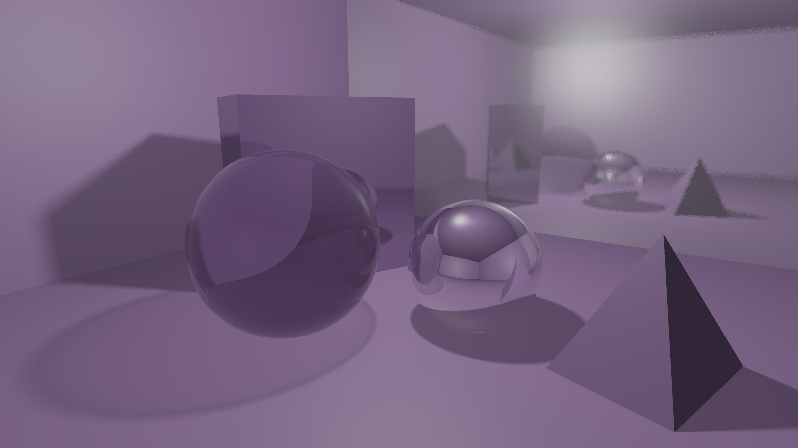

# RayTracerRTX

RayTracerRTX – приложение для рендеринга трёхмерных сцен методом трассировки лучей на GPU NVIDIA RTX. Расчёт кадра выполняется средствами NVIDIA OptiX и CUDA, окно приложения и пользовательская панель построены на GLFW, OpenGL и Dear ImGui.

Проект реализован на C++20 для Windows x64. Приложение загружает сцену, подготавливает геометрию и материалы, строит структуры ускорения OptiX, запускает трассировку лучей и выводит рассчитанный кадр в окно.

<p align="center">
  
</p>

## Основные возможности

- GPU-рендеринг через NVIDIA OptiX и CUDA;
- трассировка лучей для сфер и полигональных моделей;
- расчёт освещения, теней, отражений и преломлений;
- режим реального времени и прогрессивное накопление кадра;
- шумоподавитель OptiX для прогрессивного режима;
- загрузка OBJ/MTL и glTF/GLB;
- загрузка текстур PNG, JPG и PPM;
- материалы: матовый, металлический, зеркальный и стеклянный;
- сохранение и загрузка JSON-сцен;
- редактор сцены с изменением объектов, материалов, света, камеры и параметров рендера;
- строка статистики с FPS, GPU time, числом объектов и треугольников;
- модульные тесты, компонентные проверки и GPU smoke-тесты.

## Стек

| Компонент | Назначение |
| --- | --- |
| C++20 | основная реализация приложения |
| NVIDIA OptiX | запуск трассировки лучей и работа со структурами ускорения |
| CUDA | работа с памятью видеокарты и GPU-буферами |
| GLFW | создание окна и обработка ввода |
| OpenGL | вывод рассчитанного изображения |
| Dear ImGui | панель управления сценой |
| Visual Studio 2022, MSBuild | сборка проекта |
| Docker, Docker Compose | вспомогательные проверки окружения и документации |

## Требования

- Windows 10/11 x64;
- видеокарта NVIDIA RTX;
- драйвер NVIDIA с поддержкой CUDA;
- Visual Studio 2022;
- CUDA Toolkit 13.1;
- NVIDIA OptiX SDK 9.1.0.

Пути к CUDA Toolkit и NVIDIA OptiX SDK задаются в свойствах проекта Visual Studio. При нестандартной установке OptiX нужно обновить путь к каталогу SDK в настройках проекта.

## Сборка

Откройте `RayTracerRTX.sln` в Visual Studio 2022 и соберите конфигурацию `Debug|x64` или `Release|x64`.

Сборка из PowerShell:

```powershell
& "C:\Program Files\Microsoft Visual Studio\2022\Community\MSBuild\Current\Bin\MSBuild.exe" RayTracerRTX.sln /m /p:Configuration=Debug /p:Platform=x64
```

Исполняемый файл после сборки:

```text
x64/Debug/RayTracerRTX.exe
```

## Запуск

Запуск приложения:

```powershell
.\x64\Debug\RayTracerRTX.exe
```

Запуск с JSON-сценой:

```powershell
.\x64\Debug\RayTracerRTX.exe --scene RayTracerRTX\assets\scenes\material_room_scene.json
```

Запуск с OBJ-моделью:

```powershell
.\x64\Debug\RayTracerRTX.exe --mesh RayTracerRTX\assets\meshes\demo.obj
```

## Управление

| Ввод | Действие |
| --- | --- |
| `W/A/S/D` | перемещение камеры |
| `Space` | перемещение камеры вверх |
| `Shift` | ускорение движения камеры |
| мышь | поворот камеры при активном управлении |
| `H` | показать или скрыть панель сцены |
| `G` | переключить демонстрационную сцену |
| `C` | сбросить камеру и свет текущей сцены |
| `F5` | перезагрузить текущую JSON-сцену |
| `Q` | переключить качество рендера |
| `P` | переключить режим реального времени и режим накопления |
| `N` | включить или выключить шумоподавитель OptiX |
| `Esc` | закрыть приложение |

## Входные данные

Поддерживаемые форматы:

- `json` – описание сцены, камеры, света, окружения, объектов и материалов;
- `obj`, `mtl` – полигональные модели, материалы и ссылки на текстуры;
- `gltf`, `glb` – модели с геометрией, материалами, текстурами и трансформациями узлов;
- `png`, `jpg`, `ppm` – текстуры материалов.

Ограничения загрузчиков:

- многоугольники OBJ разбиваются на треугольники fan-методом;
- glTF/GLB загружает статическую геометрию, материалы, текстуры и простые трансформации;
- анимации, skinning и morph targets не входят в поддерживаемый набор glTF/GLB;
- embedded base64 buffers в glTF не используются.

## Структура проекта

```text
.
|-- RayTracerRTX.sln
|-- RayTracerRTX/
|   |-- src/
|   |   |-- app/       # приложение, сцена, редактор, камера, загрузчики, UI
|   |   |-- gpu/       # OptiX/CUDA-рендерер и GPU-программы
|   |   `-- common/    # общие структуры для CPU- и GPU-кода
|   |-- assets/
|   |   |-- meshes/    # демонстрационные модели и текстуры
|   |   `-- scenes/    # JSON-сцены
|   |-- docs/          # архитектура, API, анализ, производительность
|   `-- tests/         # тестовое приложение
|-- scripts/
|-- Dockerfile
`-- docker-compose.yml
```

## Проверка

Сборка тестового проекта:

```powershell
& "C:\Program Files\Microsoft Visual Studio\2022\Community\MSBuild\Current\Bin\MSBuild.exe" RayTracerRTX\tests\RayTracerRTX.Tests.sln /m /p:Configuration=Debug /p:Platform=x64
```

Запуск тестов:

```powershell
.\RayTracerRTX\tests\x64\Debug\RayTracerRTX.Tests.exe
```

Контрольная строка успешного запуска:

```text
All tests passed. Tests: 166, skipped: 0, checks: 810
```

GPU smoke-тесты требуют видеокарту NVIDIA с поддержкой используемой версии CUDA и OptiX.

## Документация

- [Архитектура](RayTracerRTX/docs/architecture.md)
- [API](RayTracerRTX/docs/api.md)
- [Статический анализ](RayTracerRTX/docs/static-analysis.md)
- [Результаты производительности](RayTracerRTX/docs/performance-results.md)
- [Зависимости](RayTracerRTX/docs/dependency-security.md)
- [Docker-проверка](RayTracerRTX/docs/docker-check.md)
- [Применение AI-инструментов](RayTracerRTX/docs/ai-assisted-development.md)

## Примечание

Docker используется для вспомогательных проверок. Интерактивный запуск OptiX-приложения выполняется в Windows, поскольку программе нужны локальный драйвер NVIDIA, доступ к GPU и графическое окно.
