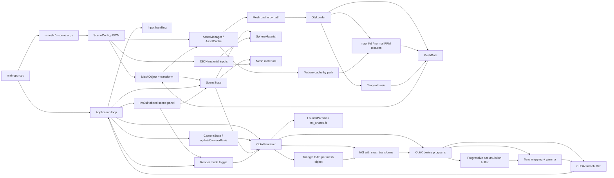
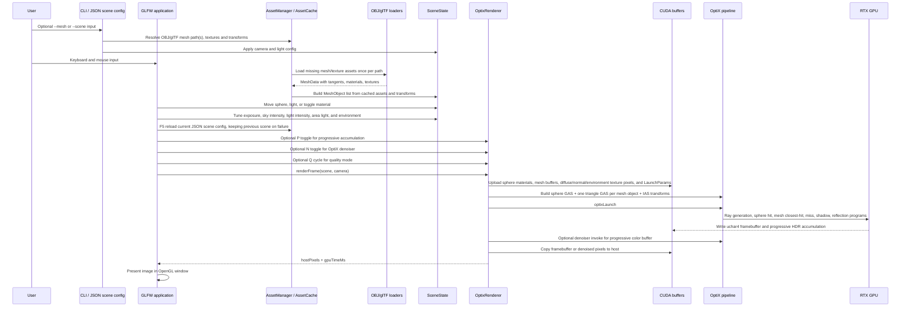
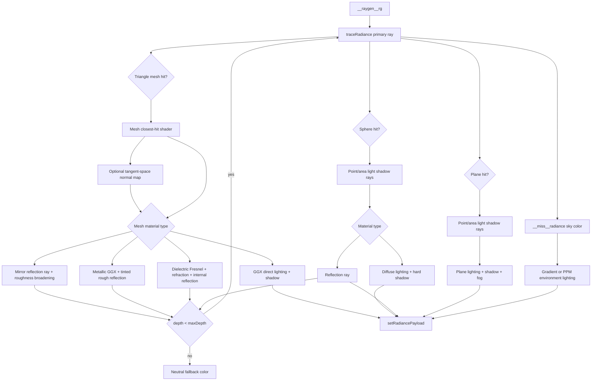
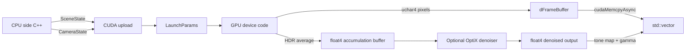

# Architecture

This document describes the implementation architecture of the real-time RTX
ray tracer. It is a technical project artifact and can be used as source
material for the coursework design section.

## Module View

## Runtime Pipeline

## OptiX Shader Flow

## Data Boundaries

## Responsibility Split

| Area | Files | Responsibility |
|---|---|---|
| Application loop | `src/app/maingpu.cpp`, `src/app/application.*` | Window creation, input, scene updates, presentation |
| UI panel | `src/app/application.*` + Dear ImGui | Tabbed runtime controls for scene presets, editor objects, materials, light, quality, and diagnostics |
| Built-in mesh primitives | `src/app/mesh.*` | Generates cube, pyramid, and finite plane/panel as `MeshData` triangles |
| Environment presets | `src/app/scene.*` | Builds editable floor, wall and ceiling panels for open/room/empty scene modes |
| Scene model | `src/app/scene.*`, `src/app/material.*`, `src/app/mesh.*`, `src/app/obj_loader.*`, `src/app/gltf_loader.*` | Spheres, OBJ/glTF mesh data, materials, selected object, light movement and clamping |
| Camera | `src/app/camera.*` | Camera state and basis vectors for ray generation |
| Shared GPU data | `src/common/rtx_shared.h` | Host/device structures used by CUDA and OptiX |
| Renderer host side | `src/gpu/optix_renderer.*` | CUDA resources, OptiX context, sphere GAS, triangle GAS, IAS, SBT, pipeline, launch, quality settings, progressive accumulation, and optional denoiser |
| Renderer device side | `src/gpu/optix_device_programs.h` | Ray generation, sphere hit, mesh closest-hit shader, miss programs, shadow and reflection logic |
| Tests | `tests/*` | CPU unit tests and native GPU smoke test |

