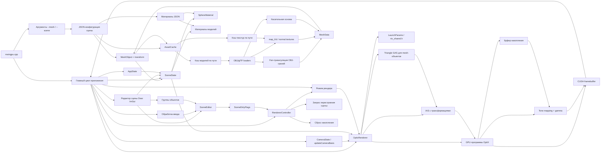
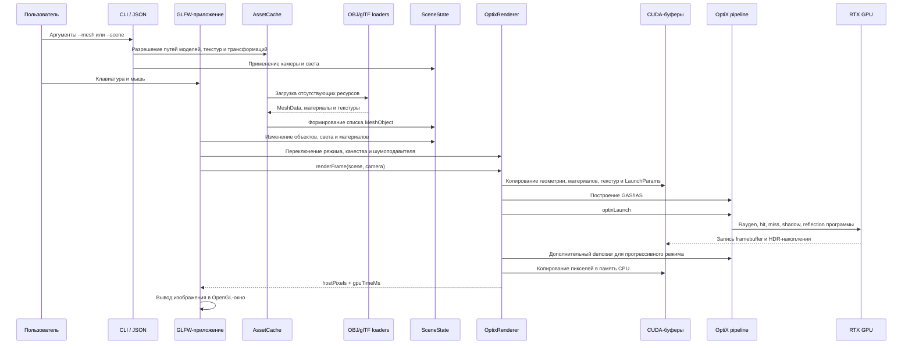
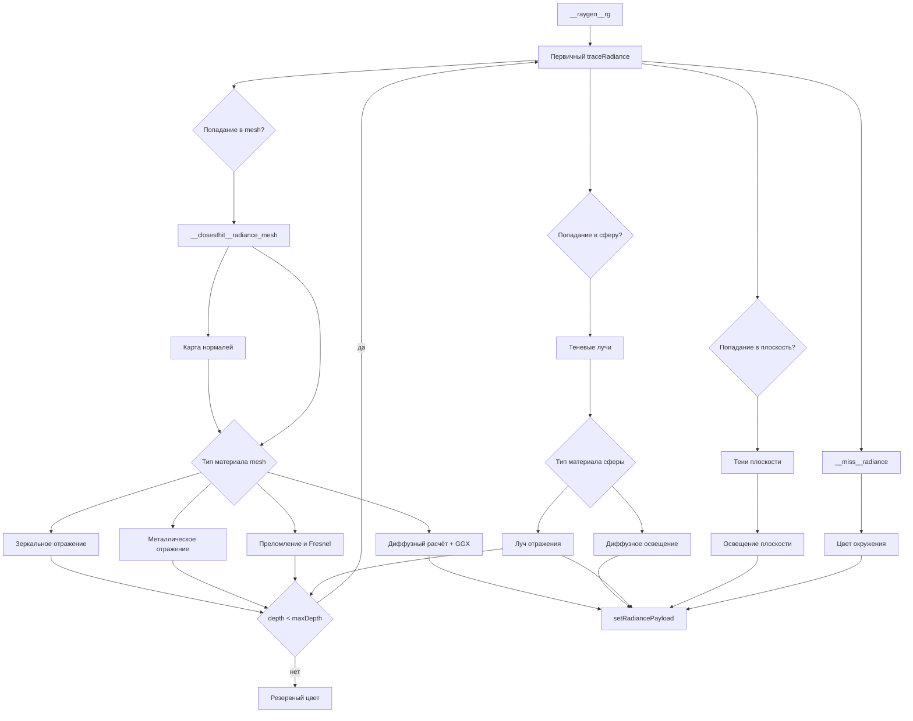
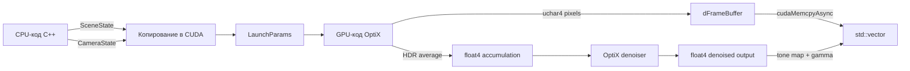

# Архитектура

Документ описывает архитектуру интерактивного RTX-трассировщика лучей. Материал относится к технической документации проекта и может использоваться как основа для проектного раздела пояснительной записки.

## Модульное представление

## Конвейер выполнения

## Поток GPU-программ OptiX

## Граница данных CPU/GPU

## Разделение ответственности

| Область | Файлы | Ответственность |
| --- | --- | --- |
| Главный цикл | `src/app/maingpu.cpp`, `src/app/application.*` | окно, ввод, обновление сцены и вывод изображения |
| Состояние приложения | `src/app/app_state.h` | камера, сцена, выбранные объекты, режим качества и запросы перестроения |
| Редактор сцены | `src/app/scene_editor.*` | изменение сцены и формирование `SceneDirtyFlags` |
| Управление рендерером | `src/app/renderer_controller.*` | сброс накопления, применение качества и пометка перестроения |
| Панель UI | `src/app/application.*`, Dear ImGui | выбор и редактирование объектов, материалов, камеры, света и качества |
| Группы объектов | `src/app/scene.*`, `src/app/scene_editor.*` | editor-level группы сфер и mesh-объектов без нового GPU-примитива |
| Встроенные mesh-примитивы | `src/app/mesh.*` | создание куба, пирамиды и прямоугольной панели как `MeshData` |
| Сцена и ресурсы | `src/app/scene.*`, `src/app/material.*`, `src/app/mesh.*`, `src/app/obj_loader.*`, `src/app/gltf_loader.*` | сферы, модели, материалы, загрузка ресурсов, свет и ограничения параметров |
| Камера | `src/app/camera.*` | состояние камеры и базисные векторы для генерации лучей |
| Общие GPU-данные | `src/common/rtx_shared.h` | структуры, общие для CPU- и GPU-кода |
| Host-часть рендерера | `src/gpu/optix_renderer.*` | CUDA-ресурсы, контекст OptiX, GAS/IAS, SBT, pipeline, запуск и denoiser |
| Device-часть рендерера | `src/gpu/optix_device_programs.h` | генерация лучей, hit/miss/shadow программы, отражения и преломления |
| Тесты | `tests/*` | CPU-проверки и GPU smoke-тесты |
